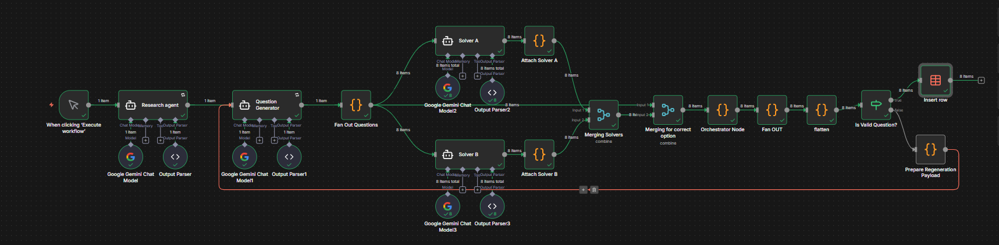

# QuantForge: Agentic AI System for Validated Quantitative Word Problems

QuantForge is an agentic AI engine that automatically researches, generates, solves, and validates quantitative aptitude word problems using n8n and LLMs. It ensures only fully validated, mathematically consistent problems are published.

##  Features

- **Research Agent:** Generates a structured rulebook (templates, formulas, impossible scenarios, hallucination traps, MCQ validation rules).
- **Problem Generator Agent:** Creates 8 fully structured quantitative word problems with numeric options, correct answers, topic, difficulty, batch ID, and unique IDs.
- **Solver Agent A:** Solves via algebraic modeling (equations, substitutions, step-by-step reasoning, confidence score).
- **Solver Agent B:** Solves using non-algebraic methods (reverse checking, brute-force substitution, logical elimination, unit-based reasoning).
- **Orchestrator Agent:** Validates correctness, detects contradictions, and marks each question as valid or rejected.

##  Workflow Overview

1. Research Agent produces rules.
2. Question Generator creates MCQs.
3. Fan-out node splits into individual questions.
4. Solver A and Solver B solve each question independently.
5. Attach nodes combine metadata.
6. Merge nodes match solver outputs by question ID.
7. Orchestrator applies validation rules.
8. Output is a bank of validated, solver-verified problems.

##  Technology Stack

- n8n (workflow engine)
- Google Gemini (PaLM) / OpenAI GPT-4.1/5.1 (LLMs)
- JavaScript (logic nodes)
- JSON schema enforcement

##  Output

- Validated quantitative word problems
- No impossible scenarios or hallucinated values
- Ready for quizzes, test banks, or educational apps

## 📄 License

This project is licensed under the MIT License. See [LICENSE](LICENSE) for details.

## Created By

Rudresh Naidu & Jordan Dsouza