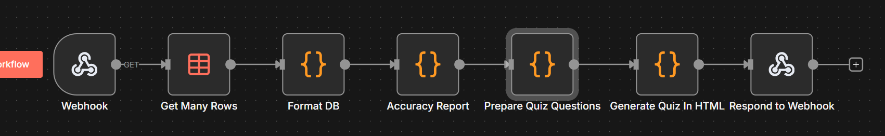

# QuantForge: Agentic AI System for Validated Quantitative Word Problems

QuantForge is an agentic AI engine that researches, generates, solves, validates, and publishes quantitative aptitude word problems using **n8n** and multiple LLM agents.  

All generated questions are solver-verified and automatically stored in a datatable, and a second workflow can retrieve and render these questions as a fully usable quiz in HTML.

---

## Features 

### 🔍 Research Agent

Generates a structured document called **"Quant Problem Design Rules"**, containing:

- Valid templates for frequently used quant topics
- Required formulas
- Impossible-scenario detection rules
- Hallucination traps and avoidance patterns

This rules document fully governs the generator.

### 🧠 Problem Generator Agent

Creates **12 structured multiple-choice questions**, each with:

- unique `id`
- numeric options (`optionA`–`optionD`)
- correct option (`A`–`D`)
- `topic`
- `difficulty`
- a unified `batchId` for the run

*(Output enforced through a strict structured parser.)*

### 👥 Dual Solver Agents

Each question is independently solved by:

- **Solver A** — algebraic, step-by-step mathematical modeling
- **Solver B** — alternative reasoning (reverse checking, substitution, unit analysis)

Both solvers produce final answers, confidence levels, and reasoning.

### 🧩 Orchestrator Agent

Combines generator and both solver outputs and performs validation:

- verifies both solvers agree
- verifies both solvers match the declared correct option
- rejects inconsistent or incorrect questions
- marks the final result with `isValidQuestion` and `rejectReasons`

### 🗄️ Data Persistence (Already Enabled)

Validated question rows are flattened and stored inside the `quant_questions` datatable, preserving:

- question text
- all 4 options
- correct answer
- topic & difficulty
- solver A & solver B reasoning
- validation metadata (`solversAgree`, `isValidQuestion`, etc.)

---

## Retrieval, Formatting & Publishing Workflow (Currently Available)

A separate workflow ([`QuantForge-Get Rows.json`](QuantForge-Get Rows.json)) is responsible for:

### 📥 Querying Stored Questions

Using the **Get Many Rows** node, it fetches questions from the datatable filtered by a chosen `batchid`.

### 🧱 Formatting & Accuracy Reporting

- Reformats questions into a normalized structure
- Computes batch accuracy analytics (accepted vs. invalid questions)

### 📝 Quiz Preparation

Builds clean question objects containing:

- `id`, `question`, `topic`, `difficulty`
- `optionA`–`optionD`
- `correctOption`
- normalized `options[]` array

### 🌐 HTML Quiz Renderer

The workflow generates a complete, ready-to-use HTML quiz page:

- radio-button MCQs
- submit button
- automatic scoring
- correct answer reveal
- per-question feedback
- score summary

### 🌍 Webhook Delivery

A Webhook serves the final HTML at the `/quiz` endpoint:

1. User opens the link
2. n8n returns the generated quiz HTML
3. The quiz is fully interactive in the browser

---

## Workflow Overview 

### Main Generation Pipeline ([`QuantForge.json`](QuantForge.json))

1. **Research Agent** produces the rulebook
2. **Problem Generator Agent** creates a batch of 12 MCQs
3. **Fan-out** sends each question to solvers
4. **Solver A** and **Solver B** solve independently
5. **Attach & Merge** nodes combine question + solver outputs
6. **Orchestrator Agent** validates each question
7. **Flatten + Datatable** node stores validated questions

### Retrieval & Quiz Pipeline ([`QuantForge-Get Rows.json`](QuantForge-Get Rows.json))

1. **Get Rows Workflow** retrieves questions from storage
2. **Prepare Quiz Questions** transforms for display
3. **Generate Quiz in HTML** renders interactive MCQ quiz
4. **Webhook** returns the HTML directly to the user

---

## Technology Stack

- **n8n** workflows and automation
- **Google Gemini / PaLM** and **OpenAI GPT-4.1 / GPT-5.1** models
- **Structured Output Parsers** for strict schema enforcement
- **Dual-solver validation architecture**
- **HTML/JS quiz rendering**
- **Datatable storage** for validated questions

---

## Output

- A rigorously validated set of quantitative MCQs
- Dual-solver-verified correctness
- Automatically stored problem bank
- Fully functional, auto-scoring HTML quiz served via webhook
- Batch analytics (accepted/invalid questions)

---

## 📄 License

This project is licensed under the MIT License. See [LICENSE](LICENSE) for details.